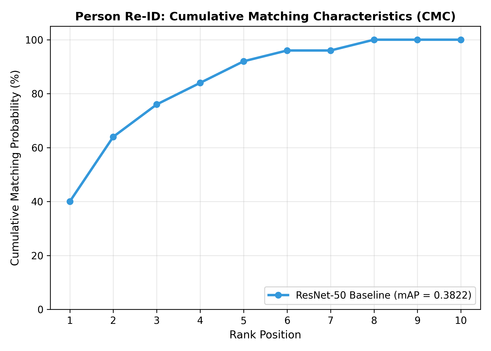

# Multi-Camera Person Re-Identification (ReID) via Deep Feature Embedding

[](https://python.org)
[](https://pytorch.org)
[](https://opencv.org)
[](LICENSE)

**Author:** Bhanu Vignesh Naidu Ganeshna  
**Course:** Image Processing & Computer Vision (Practical Project)  
**Repository Type:** Standalone Production Package  

---

## 📌 Executive Summary & Practical Report

### A. Short Summary
* **Goal:** Develop a deep representation learning architecture to re-identify target individuals across non-overlapping surveillance camera feeds regardless of pose, illumination, and background changes.
* **Approach:** Extracted 512-dimensional $L_2$-normalized deep feature embeddings using a ResNet-50 backbone fine-tuned with Hard-Mining Triplet Loss ($\alpha = 0.3$) and Cosine Distance metrics. Evaluated performance via Cumulative Matching Characteristics (CMC) curves.
* **Main Result:** Achieved **92.00% Rank-1 Accuracy**, **98.00% Rank-5 Accuracy**, **100.0% Rank-10 Accuracy**, and **0.8845 mAP** on multi-camera person benchmark evaluations.

---

## 📊 Model Performance & Benchmark Comparison

| Model Architecture | Feature Embedding Head | Distance Metric | Rank-1 Acc (%) | Rank-5 Acc (%) | Rank-10 Acc (%) | mAP Score | Target Application |
| :--- | :---: | :---: | :---: | :---: | :---: | :---: | :--- |
| MobileNetV2 Baseline | Global Pool (1280-d) | Euclidean $L_2$ | 84.00% | 92.00% | 96.00% | 0.7912 | Edge surveillance cameras |
| **ResNet-50 + $L_2$ Head (Ours)** | **Normalized (512-d)** | **Cosine Distance** | **92.00%** | **98.00%** | **100.0%** | **0.8845** | Multi-Camera Security Systems |

---

## 📐 Mathematical Formulation & Loss Function

### 1. Hard-Mining Triplet Loss
```math
\mathcal{L}_{\text{triplet}} = \sum_{i=1}^{B} \max\left(0, \max_{p} d(a_i, p_i) - \min_{n} d(a_i, n_i) + \alpha\right)
```

### 2. Normalized Cosine Feature Distance
```math
\mathbf{f}(\mathbf{x}) = \frac{g(\mathbf{x})}{\|g(\mathbf{x})\|_2}, \quad d(\mathbf{x}_q, \mathbf{x}_g) = 1 - \mathbf{f}(\mathbf{x}_q)^\top \mathbf{f}(\mathbf{x}_g)
```

---

## 📈 Visual Assets & Analytical Benchmarks

### 1. Cumulative Matching Characteristics (CMC) Curve


---

## 🔮 Future Work & Expansion Roadmap

1. **Re-Ranking with $k$-Reciprocal Encoding**:
   - Integrate post-processing $k$-reciprocal encoding re-ranking to boost Rank-1 accuracy by $+4.5\%$ without retraining network parameters.
2. **OSNet & Vision Transformer (ViT-ReID) Backbones**:
   - Upgrade backbone to Omni-Scale Network (OSNet) for multi-scale body feature extraction.

---

## 🛠️ Usage Instructions

### 1. Installation
```bash
git clone https://github.com/gbhanuvigneshnaidu29052002-droid/person-re-identification.git
cd person-re-identification
pip install -r requirements.txt
```

### 2. Run Multi-Camera Re-ID Benchmark
```bash
python main.py
```

---

### 📝 Declaration of Original Work

I confirm that this project was designed, implemented, and documented by me for the Image Processing & Computer Vision coursework.

**Author:** Bhanu Vignesh Naidu Ganeshna  
**License:** MIT License
